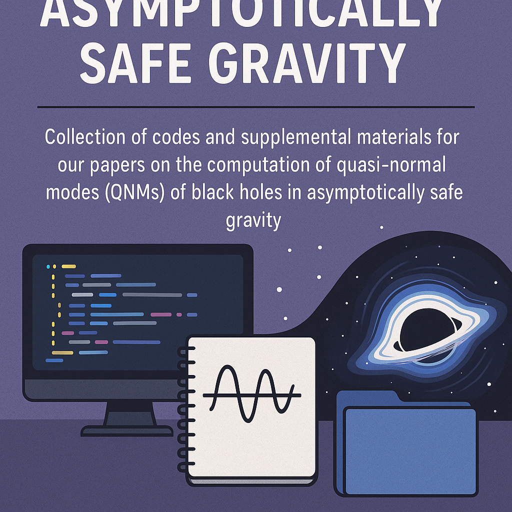
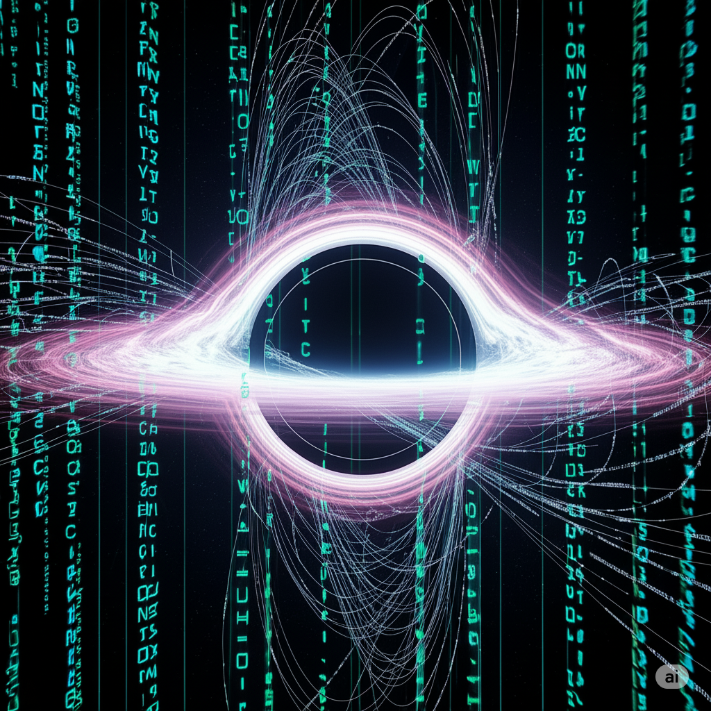

# Asymptotically Safe Gravity



Collection of codes and supplemental materials for our series of three papers on the computation of quasi-normal modes (QNMs) of black holes in asymptotically safe gravity.

Repository: https://github.com/dutykh/ASafeGravity/

## Authors

- Dr. Davide Batic (Mathematics Department, Khalifa University of Science and Technology, PO Box 127788, Abu Dhabi, United Arab Emirates)
- Dr. Denys Dutykh (Mathematics Department, Khalifa University of Science and Technology, PO Box 127788, Abu Dhabi, United Arab Emirates)
- Dr. Fabio Scardigli (Dipartimento di Matematica, Politecnico di Milano, Piazza Leonardo da Vinci 32, 20133 Milano, Italy)

## Publications

This repository accompanies a series of three articles. The directory names
`Paper1NegAlpha/`, `Paper2PosAlpha/`, and `Paper3HaywardBH/` correspond to the
papers listed below.

1. **Paper 1 (published).** D. Batic, D. Dutykh, and F. Scardigli,
   *Spectral analysis of quasinormal modes of Planck stars*,
   Eur. Phys. J. C **86**, 165 (2026).
   [doi:10.1140/epjc/s10052-026-15430-8](https://doi.org/10.1140/epjc/s10052-026-15430-8).
   [Published version](https://link.springer.com/article/10.1140/epjc/s10052-026-15430-8);
   [preprint arXiv:2602.19833](https://arxiv.org/abs/2602.19833)
2. **Paper 2 (published).** D. Batic, D. Dutykh, and F. Scardigli,
   *Quasinormal modes of Bonanno–Reuter black holes via the spectral method*,
   Phys. Rev. D **114**, 024023 (2026).
   [doi:10.1103/sgt6-kwfl](https://doi.org/10.1103/sgt6-kwfl).
   [Published version](https://journals.aps.org/prd/abstract/10.1103/sgt6-kwfl);
   [preprint arXiv:2607.10199](https://arxiv.org/abs/2607.10199)
3. **Paper 3 (in preparation).** D. Batic and D. Dutykh,
   *Quasinormal modes of Hayward black holes via the spectral method*
   (manuscript in preparation).

### How to cite

If you use these codes or data, please cite the relevant paper. BibTeX for the
published papers:

```bibtex
@article{Batic2026PlanckStars,
  author  = {Batic, Davide and Dutykh, Denys and Scardigli, Fabio},
  title   = {Spectral analysis of quasinormal modes of {P}lanck stars},
  journal = {The European Physical Journal C},
  volume  = {86},
  pages   = {165},
  year    = {2026},
  doi     = {10.1140/epjc/s10052-026-15430-8},
}

@article{Batic2026BonannoReuter,
  author  = {Batic, Davide and Dutykh, Denys and Scardigli, Fabio},
  title   = {Quasinormal modes of {B}onanno--{R}euter black holes via the spectral method},
  journal = {Physical Review D},
  volume  = {114},
  pages   = {024023},
  year    = {2026},
  doi     = {10.1103/sgt6-kwfl},
}
```

## QNMs Hall of Fame

A companion website, the **QNMs Hall of Fame**, collects the quasi-normal mode
spectra computed in this series in a browsable form, so that individual modes
can be inspected, compared across spins and multipoles, and retrieved without
opening the raw report files:

https://qnms.denys-dutykh.com/

## Repository Structure

The repository is organized by tool (`maple/`, `matlab/`) and by output
(`qnmdata/`), with one subdirectory per paper at the next level:

```text
ASafeGravity/
├── maple/       symbolic derivations and supplemental worksheets
├── matlab/      Maple procedures assembling the spectral matrices for Matlab
├── qnmdata/     computed QNM spectra (plain-text reports)
├── pics/        images used in this file
├── LICENSE      GNU GPL v3
└── README.md
```

### `maple/`

Maple worksheets (`.mw`) documenting the derivation of the perturbation
equation, its transformation to the spectral formulation, and the supplemental
material distributed with each paper:

- `Paper1NegAlpha/01-SUPPLEMENTAL MATERIAL-PLANCK.mw`
- `Paper2PosAlpha/extreme/01-SUPPLEMENTAL MATERIAL-EXTREME.mw`
- `Paper2PosAlpha/nonextreme/01-SUPPLEMENTAL MATERIAL-NONEXTREME-CASE.mw`
- `Paper3HaywardBH/extreme/01-SUPPLEMENTAL MATERIAL - EXTREME CASE.mw`
- `Paper3HaywardBH/nonextreme/01- SUPPLEMENTAL MATERIAL - NONEXTREME CASE.mw`

### `matlab/`

Each `matrixassembler.mpl` is a Maple procedure `MatrixAssembler` that builds
the three matrices `M0`, `M1`, `M2` of the quadratic eigenvalue problem

```text
( M0  +  ω M1  +  ω² M2 ) c  =  0
```

by collocating the radial equation at Chebyshev points and expanding the
solution in Chebyshev polynomials. The matrices are produced in
multiprecision arithmetic (the number of digits is an argument) and exported
with `ExportMatrix(..., target = MATLAB)` as `M0_N.mat`, `M1_N.mat`,
`M2_N.mat` in a `data/` subfolder, where `N` is the number of Chebyshev modes.
The Matlab side then solves the resulting polynomial eigenvalue problem and
filters the spectrum by comparing several resolutions.

Arguments, common to all versions: `d` (working digits), `N` (Chebyshev
modes), `s` (spin of the perturbation), `L` (angular momentum, `L ⩾ s`), and
`p` (output path). The non-extremal versions take in addition `g` (the
parameter `γ`) and `M` (the black-hole mass); in the extremal version both are
fixed internally by solving for the degenerate horizon.

- `Paper1NegAlpha/matrixassembler.mpl` (negative `α = -41/(10π)`)
- `Paper2PosAlpha/nonextreme/matrixassembler.mpl` (positive `α = 118/(15π)`)
- `Paper2PosAlpha/extreme/matrixassembler.mpl` (extremal Bonanno–Reuter black hole)

### `qnmdata/`

Computed spectra, one plain-text report per parameter set. A report begins
with a header giving the date, the parameters `s`, `L`, `γ`, `M` and the
resolutions used, followed by the modes common to all resolutions within the
stated tolerance, split into modes with a positive real part and purely
imaginary modes.

```text
qnmdata/
├── Paper1NegAlpha/       s{0,1,2}/g{0_5,4_5}/            60 reports
├── Paper2PosAlpha/
│   ├── extreme/          s{0,1,2}/L*/                    18 reports
│   └── nonextreme/       s{0,1,2}/L*/M*/                 55 reports
└── Paper3HaywardBH/
    ├── extreme/          s{0,1,2}/L*/                    18 reports
    ├── nearextreme/      s0/L{0,1}/g59_50/                2 reports
    └── nonextreme/       s{0,1,2}/L*/g*/                 33 reports
```

Directory-name conventions:

- `s0`, `s1`, `s2`: spin of the perturbation (scalar, electromagnetic,
  gravitational).
- `L0`, `L1`, ...: angular momentum `L`, with `L ⩾ s`.
- `g...`: the value of `γ`, with the underscore standing for a fraction bar.
  In Paper 1, `g0_5` is `γ = 1/2` and `g4_5` is `γ = 9/2`. In Paper 3 the
  denominator is kept explicit: `g4_27` is `γ = 4/27 ≈ 0.14815`, `g59_50` is
  `γ = 59/50 = 1.18`, and `g0`, `g1` are integers.
- `M...`: the black-hole mass, with the underscore as a decimal point
  (`M5_0` is `M = 5`, `M3_503` is `M ≈ 3.503`, `M1000_0` is `M = 1000`, close
  to the Schwarzschild limit).

Paper 1 covers ten multipoles per spin (`L = 0..9` for `s = 0`, `L = 1..10`
for `s = 1`, `L = 2..11` for `s = 2`) at `M = 1`. Paper 2 and Paper 3 split
the parameter space into the extremal case, where the mass and horizon are
fixed by the double-root condition, and the non-extremal case, where `γ` and
`M` are scanned. Paper 3 adds a near-extremal group at `γ = 59/50`.

## Usage

Browse the directory of the paper of interest: the Maple worksheet for the
derivation, `matrixassembler.mpl` for the assembly of the spectral matrices,
and `qnmdata/` for the resulting spectra. To reproduce a given report, run
`MatrixAssembler` with the parameters printed in that report's header at the
three resolutions it lists, and keep the modes common to all three.

## License

Released under the GNU General Public License v3; see `LICENSE`.

<table>
<tr>
<td></td>
<td></td>
</tr>
</table>
